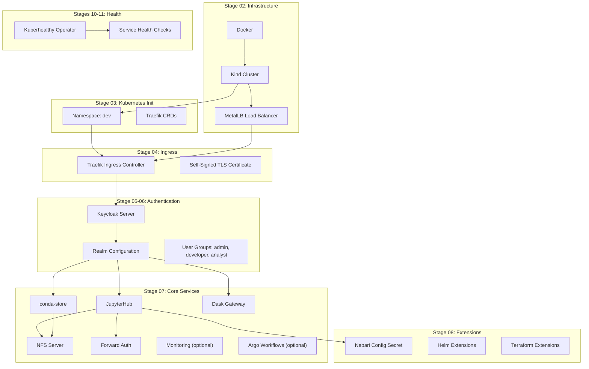

# Nebari Local Deployment Guide

> Deploy Nebari on your local machine using Terraform and Kind (Kubernetes in Docker).

This guide explains how to deploy Nebari's full data science platform locally using **Terraform** (not OpenTofu). The deployment runs inside a Kind cluster on Docker and includes JupyterHub, conda-store, Dask Gateway, Keycloak SSO, and more.

---

## Table of Contents

- [Overview](#overview)
- [Architecture](#architecture)
- [Prerequisites](#prerequisites)
- [Configuration](#configuration)
- [Running the Deployment](#running-the-deployment)
- [Stage-by-Stage Reference](#stage-by-stage-reference)
  - [Stage 01 – Terraform State](#stage-01--terraform-state)
  - [Stage 02 – Infrastructure (Kind + MetalLB)](#stage-02--infrastructure-kind--metallb)
  - [Stage 03 – Kubernetes Initialize](#stage-03--kubernetes-initialize)
  - [Stage 04 – Kubernetes Ingress (Traefik)](#stage-04--kubernetes-ingress-traefik)
  - [Stage 05 – Keycloak Deployment](#stage-05--keycloak-deployment)
  - [Stage 06 – Keycloak Configuration](#stage-06--keycloak-configuration)
  - [Stage 07 – Kubernetes Services](#stage-07--kubernetes-services)
  - [Stage 08 – Nebari Extensions](#stage-08--nebari-extensions)
  - [Stage 10 – Kuberhealthy Operator](#stage-10--kuberhealthy-operator)
  - [Stage 11 – Health Checks](#stage-11--health-checks)
- [Accessing Services](#accessing-services)
- [Destroying the Deployment](#destroying-the-deployment)
- [Troubleshooting](#troubleshooting)

---

## Overview

Nebari is a data science platform that bundles JupyterHub, Dask, conda-store, and authentication into a single Kubernetes deployment. The platform normally deploys to cloud providers (AWS, GCP, Azure) or existing Kubernetes clusters. This guide covers **local deployment** using:

| Component | Purpose |
|-----------|---------|
| **Kind** | Creates a local Kubernetes cluster inside Docker containers |
| **MetalLB** | Provides LoadBalancer IPs on the local Docker network |
| **Traefik** | Ingress controller routing traffic to services |
| **Keycloak** | Identity and access management (SSO) |
| **JupyterHub** | Multi-user Jupyter notebook server |
| **conda-store** | Environment management for conda |
| **Dask Gateway** | Scalable parallel computing |
| **Kuberhealthy** | Health monitoring for all services |

## Architecture



### Stage Dependency Flow

Each stage depends on outputs from prior stages:

| Stage | Depends On | Outputs Used By |
|-------|-----------|-----------------|
| 01 | — | — |
| 02 | Docker | Kubeconfig → Stages 03-11 |
| 03 | Stage 02 | — |
| 04 | Stage 03 | Load Balancer IP → Stages 05-08 |
| 05 | Stage 04 | Keycloak credentials → Stage 06-08 |
| 06 | Stage 05 | Realm ID, read-only credentials → Stages 07-08 |
| 07 | Stage 06 | Forward-auth middleware → Stage 08 |
| 08 | Stage 07 | — |
| 10 | Stage 02 | — |
| 11 | Stage 10 | — |

---

## Prerequisites

### Required Tools

| Tool | Minimum Version | Install Command |
|------|----------------|-----------------|
| **Terraform** | ≥ 1.0 | [terraform.io/downloads](https://developer.hashicorp.com/terraform/downloads) |
| **Docker** | ≥ 20.10 | [docs.docker.com/get-docker](https://docs.docker.com/get-docker/) |
| **Kind** | ≥ 0.20 | `go install sigs.k8s.io/kind@latest` or [releases](https://github.com/kubernetes-sigs/kind/releases) |
| **kubectl** | ≥ 1.28 | [kubernetes.io/docs/tasks/tools](https://kubernetes.io/docs/tasks/tools/) |
| **jq** | ≥ 1.6 | `apt install jq` / `brew install jq` |
| **Helm** | ≥ 3.0 | [helm.sh/docs/intro/install](https://helm.sh/docs/intro/install/) |

### System Requirements

| Resource | Minimum | Recommended |
|----------|---------|-------------|
| **CPU** | 4 cores | 8+ cores |
| **RAM** | 8 GB | 16+ GB |
| **Disk** | 30 GB free | 50+ GB free |

> [!IMPORTANT]
> Docker must be running with adequate resource limits. On Docker Desktop, go to **Settings → Resources** and allocate at least 8 GB of memory and 4 CPUs.

### Optional Tools

| Tool | Purpose |
|------|---------|
| **python3 + PyYAML** | Converts `nebari-config.yaml` to JSON for Stage 08 |
| **shellcheck** | Lints the deployment script |

---

## Configuration

Edit the **Configuration** section at the top of `deploy-nebari-local.sh`:

```bash
# Project identity
PROJECT_NAME="nebari-test"      # Name prefix for all resources
NAMESPACE="dev"                  # Kubernetes namespace
NEBARI_VERSION="2025.10.1"       # Nebari version (used for image tags)

# Authentication
KEYCLOAK_ROOT_PASSWORD="..."     # Keycloak admin password

# Container images — update tags for your Nebari version
JUPYTERHUB_IMAGE="quay.io/nebari/nebari-jupyterhub"
JUPYTERLAB_IMAGE="quay.io/nebari/nebari-jupyterlab"
DASK_WORKER_IMAGE="quay.io/nebari/nebari-dask-worker"
CONDA_STORE_IMAGE="quay.io/nebari/nebari-conda-store"

# Resource settings
SHARED_STORAGE_GB=10             # Shared NFS storage for JupyterHub (GB)
CONDA_STORE_STORAGE="20Gi"      # conda-store filesystem storage

# Feature toggles
MONITORING_ENABLED=false         # Prometheus + Grafana
ARGO_WORKFLOWS_ENABLED=false     # Argo Workflows
JHUB_APPS_ENABLED=false          # JupyterHub Apps
SHARED_FS_TYPE="nfs"             # "nfs" or "cephfs"
```

> [!TIP]
> For a minimal local deployment with limited resources, keep `MONITORING_ENABLED`, `ARGO_WORKFLOWS_ENABLED`, and `JHUB_APPS_ENABLED` set to `false`. Each optional service adds significant CPU and memory consumption.

---

## Running the Deployment

### Full Deployment

```bash
# Make the script executable
chmod +x deploy-nebari-local.sh

# Deploy everything
./deploy-nebari-local.sh
```

### Dry Run (Plan Only)

```bash
# See what Terraform would create without applying
./deploy-nebari-local.sh --plan-only
```

### Deploy a Single Stage

```bash
# Deploy only Stage 02 (infrastructure)
./deploy-nebari-local.sh --stage 02

# Deploy from Stage 05 onward (useful for resuming)
./deploy-nebari-local.sh --from-stage 05
```

### Destroy Everything

```bash
# Tear down all resources in reverse order
./deploy-nebari-local.sh --destroy
```

---

## Stage-by-Stage Reference

### Stage 01 – Terraform State

**Purpose:** Configure the Terraform state backend.

**What happens:** For local deployments, this is a **no-op**. Terraform state is stored in each stage's directory (local backend). In cloud deployments, this would configure remote state storage (S3, GCS, etc.).

| Detail | Value |
|--------|-------|
| **Directory** | `stages/01-terraform-state/local/` |
| **Terraform Files** | `main.tf` (empty) |
| **Providers** | None |
| **Outputs** | None |

---

### Stage 02 – Infrastructure (Kind + MetalLB)

**Purpose:** Create the local Kubernetes cluster and configure network load balancing.

**What happens:**
1. Creates a **Kind cluster** named `test-cluster` using Docker
2. Deploys **MetalLB** to enable LoadBalancer-type services on Docker's network
3. Configures MetalLB with an IP address range derived from the Docker `kind` network CIDR
4. Writes a kubeconfig file for cluster access

| Detail | Value |
|--------|-------|
| **Directory** | `stages/02-infrastructure/local/` |
| **Terraform Providers** | `tehcyx/kind`, `kreuzwerker/docker`, `gavinbunney/kubectl`, `hashicorp/kubernetes` |
| **Key Resources** | `kind_cluster.default`, MetalLB DaemonSet, ConfigMap for IP ranges |

**Variables:**

| Variable | Type | Description |
|----------|------|-------------|
| `kubeconfig_filename` | string | Path where the kubeconfig will be written |
| `kube_context` | string | Optional Kubernetes context name |

**Outputs:**

| Output | Description | Used By |
|--------|-------------|---------|
| `kubernetes_credentials` | Cluster CA cert, client cert, client key, host URL | Stages 03-08 (via kubeconfig) |
| `kubeconfig_filename` | Path to the generated kubeconfig file | All subsequent stages |

**Key Files:**
- `main.tf` — Kind cluster, MetalLB namespace, MetalLB manifests, load balancer IP range
- `metallb.yaml` — MetalLB controller deployment, speaker DaemonSet, RBAC, and ServiceAccounts
- `outputs.tf` — Kubernetes credentials and kubeconfig path

> [!NOTE]
> MetalLB assigns IPs from the Docker network CIDR (addresses 356-406 in the subnet). These IPs are only reachable from the Docker host.

---

### Stage 03 – Kubernetes Initialize

**Purpose:** Create the application namespace and install prerequisite Kubernetes resources.

**What happens:**
1. Creates the **Kubernetes namespace** (default: `dev`)
2. Installs **Traefik CRDs** (Custom Resource Definitions) for IngressRoute support
3. Optionally installs NVIDIA GPU drivers (disabled for local)
4. Optionally installs cluster autoscaler (AWS only, disabled for local)

| Detail | Value |
|--------|-------|
| **Directory** | `stages/03-kubernetes-initialize/` |
| **Terraform Providers** | `hashicorp/kubernetes`, `hashicorp/helm` |
| **Modules** | `initialization`, `traefik_crds`, `cluster-autoscaler` (AWS), `nvidia-installer` (GPU) |

**Variables:**

| Variable | Type | Local Value | Description |
|----------|------|-------------|-------------|
| `name` | string | `"nebari-test"` | Project name prefix |
| `environment` | string | `"dev"` | Kubernetes namespace |
| `cloud_provider` | string | `"local"` | Cloud provider identifier |
| `aws_region` | string | `""` | AWS region (unused for local) |
| `external_container_reg` | object | `{enabled: false}` | External container registry config |
| `gpu_enabled` | bool | `false` | Enable GPU support |
| `gpu_node_group_names` | list | `[]` | GPU node group names |

---

### Stage 04 – Kubernetes Ingress (Traefik)

**Purpose:** Deploy Traefik as the ingress controller to route external traffic to internal services.

**What happens:**
1. Deploys **Traefik** via Helm chart as a LoadBalancer service
2. Configures **self-signed TLS certificates** for HTTPS
3. Assigns a MetalLB IP as the external entrypoint

| Detail | Value |
|--------|-------|
| **Directory** | `stages/04-kubernetes-ingress/` |
| **Terraform Providers** | `hashicorp/kubernetes`, `hashicorp/helm` |
| **Modules** | `kubernetes/ingress` |

**Variables:**

| Variable | Type | Default | Description |
|----------|------|---------|-------------|
| `name` | string | — | Project name |
| `environment` | string | — | Kubernetes namespace |
| `node_groups` | map(object) | — | Node selector labels |
| `traefik-image` | object | — | Traefik container image `{image, tag}` |
| `certificate-service` | string | `"self-signed"` | TLS certificate provider |
| `acme-email` | string | `"nebari@example.com"` | ACME email (for Let's Encrypt) |
| `load-balancer-ip` | string | `null` | Optional static LB IP |

**Outputs:**

| Output | Description | Used By |
|--------|-------------|---------|
| `load_balancer_address` | External IP of the Traefik LoadBalancer service | Stages 05-08 (as endpoint via nip.io) |

> [!NOTE]
> The script uses **nip.io** wildcard DNS: the load balancer IP `172.18.1.100` becomes the endpoint `172.18.1.100.nip.io`, which resolves back to the same IP. This allows HTTPS certificates and routing to work correctly without manual DNS configuration.

---

### Stage 05 – Keycloak Deployment

**Purpose:** Deploy Keycloak as the identity provider for single sign-on (SSO).

**What happens:**
1. Generates a random password for the `nebari-bot` service account
2. Deploys **Keycloak** via Helm chart with the configured admin password
3. Configures Keycloak to serve under the `/auth` path prefix

| Detail | Value |
|--------|-------|
| **Directory** | `stages/05-kubernetes-keycloak/` |
| **Terraform Providers** | `hashicorp/kubernetes`, `hashicorp/helm` |
| **Modules** | `kubernetes/keycloak-helm` |

**Variables:**

| Variable | Type | Description |
|----------|------|-------------|
| `name` | string | Project name |
| `environment` | string | Kubernetes namespace |
| `endpoint` | string | External URL (e.g., `172.18.1.100.nip.io`) |
| `initial_root_password` | string | Keycloak admin password |
| `overrides` | list(string) | Helm value overrides |
| `node_group` | object | Node selector `{key, value}` |
| `themes` | object | Custom Keycloak themes `{enabled, repository, branch}` |

**Outputs:**

| Output | Description | Used By |
|--------|-------------|---------|
| `keycloak_credentials` | Admin URL, username, password | Script (for Keycloak provider env vars) |
| `keycloak_nebari_bot_password` | Service account password | Stage 08 |

---

### Stage 06 – Keycloak Configuration

**Purpose:** Configure the Keycloak realm, user groups, permissions, and authentication flows.

**What happens:**
1. Creates a **Keycloak realm** named after the project
2. Creates **user groups**: `admin`, `developer`, `analyst`, `superadmin`
3. Sets `analyst` as the **default group** for new users
4. Assigns **RBAC roles**: admin gets manage-users, superadmin gets realm-admin
5. Creates a **read-only user** for service monitoring
6. Configures authentication flows (GitHub OAuth, Auth0 if enabled)
7. Enables **event logging** for auditing

| Detail | Value |
|--------|-------|
| **Directory** | `stages/06-kubernetes-keycloak-configuration/` |
| **Terraform Providers** | `hashicorp/kubernetes`, `hashicorp/helm`, `mrparkers/keycloak` |

**Variables:**

| Variable | Type | Description |
|----------|------|-------------|
| `realm` | string | Realm name (usually project name) |
| `realm_display_name` | string | Display name for the realm |
| `keycloak_groups` | set(string) | Groups to create |
| `default_groups` | set(string) | Groups assigned to new users by default |
| `authentication` | any | Auth config `{type: "password"}` or `{type: "GitHub", config: {...}}` |

**Outputs:**

| Output | Description | Used By |
|--------|-------------|---------|
| `realm_id` | Keycloak realm identifier | Stages 07-08 |
| `keycloak-read-only-user-credentials` | Read-only user credentials `{username, password}` | Stage 07 |

> [!IMPORTANT]
> The Keycloak provider connects via HTTPS to the Traefik ingress. Since TLS is self-signed, the provider uses `tls_insecure_skip_verify = true`. The connection is configured through environment variables (`KEYCLOAK_URL`, `KEYCLOAK_USER`, `KEYCLOAK_PASSWORD`, etc.).

---

### Stage 07 – Kubernetes Services

**Purpose:** Deploy all core Nebari data science services.

This is the largest and most complex stage, deploying:

| Service | Description |
|---------|-------------|
| **NFS Server** | Shared persistent storage for notebooks and environments |
| **JupyterHub** | Multi-user notebook server with Keycloak authentication |
| **conda-store** | Reproducible environment management |
| **Dask Gateway** | Distributed computing gateway |
| **Forward Auth** | Traefik middleware for SSO-protected routes |
| **Monitoring** | Prometheus + Grafana (optional) |
| **Grafana Loki** | Log aggregation (optional, with monitoring) |
| **Argo Workflows** | Workflow orchestration (optional) |
| **Rook-Ceph** | Distributed storage (if `shared_fs_type = "cephfs"`) |

| Detail | Value |
|--------|-------|
| **Directory** | `stages/07-kubernetes-services/` |
| **Terraform Providers** | `hashicorp/kubernetes`, `hashicorp/helm`, `mrparkers/keycloak` |
| **Modules** | 10+ submodules under `modules/kubernetes/services/` |

**Key Variables (selected):**

| Variable | Type | Description |
|----------|------|-------------|
| `jupyterhub-image` | object | JupyterHub container image `{name, tag}` |
| `jupyterlab-image` | object | JupyterLab container image `{name, tag}` |
| `jupyterhub-shared-storage` | number | Shared storage size in GB |
| `shared_fs_type` | string | `"nfs"` or `"cephfs"` |
| `conda-store-image` | string | conda-store container image |
| `conda-store-image-tag` | string | conda-store version tag |
| `conda-store-filesystem-storage` | string | Storage allocation (e.g., `"20Gi"`) |
| `dask-worker-image` | object | Dask worker image `{name, tag}` |
| `monitoring-enabled` | bool | Enable Prometheus + Grafana |
| `argo-workflows-enabled` | bool | Enable Argo Workflows |
| `realm_id` | string | Keycloak realm ID (from Stage 06) |
| `forwardauth_middleware_name` | string | Traefik forward-auth middleware name |

**Outputs:**

| Output | Description |
|--------|-------------|
| `service_urls` | URLs for all deployed services |
| `forward-auth-middleware` | Middleware name for SSO-protected routes |
| `forward-auth-service` | Forward auth service reference |

> [!TIP]
> For a minimal local deployment, disable monitoring (`MONITORING_ENABLED=false`) and Argo Workflows (`ARGO_WORKFLOWS_ENABLED=false`). These can be enabled later by re-running from Stage 07.

---

### Stage 08 – Nebari Extensions

**Purpose:** Deploy custom Terraform extensions, Helm extensions, and store the nebari-config as a Kubernetes secret.

**What happens:**
1. Stores `nebari-config.yaml` as a **Kubernetes secret** (`nebari-config-yaml`) for services to read
2. Deploys any configured **Terraform extensions** (custom services with OAuth integration)
3. Deploys any configured **Helm chart extensions**

| Detail | Value |
|--------|-------|
| **Directory** | `stages/08-nebari-tf-extensions/` |
| **Terraform Providers** | `hashicorp/kubernetes`, `hashicorp/helm`, `mrparkers/keycloak` |
| **Modules** | `nebariextension`, `helm-extensions` |

**Variables:**

| Variable | Type | Description |
|----------|------|-------------|
| `environment` | string | Kubernetes namespace |
| `endpoint` | string | Cluster endpoint |
| `realm_id` | string | Keycloak realm ID |
| `tf_extensions` | list | Terraform extensions to deploy |
| `helm_extensions` | list | Helm charts to install |
| `nebari_config_yaml` | any | Full nebari-config.yaml as a data structure |
| `keycloak_nebari_bot_password` | string | Bot password (from Stage 05) |
| `forwardauth_middleware_name` | string | Forward auth middleware name |

---

### Stage 10 – Kuberhealthy Operator

**Purpose:** Install the Kuberhealthy health monitoring operator and its CRDs.

**What happens:**
1. Applies **Custom Resource Definitions** (KHCheck, KHJob, KHState)
2. Deploys the **Kuberhealthy controller** deployment
3. Sets up built-in health checks (DaemonSet, Deployment, DNS)
4. Creates RBAC roles and service accounts

| Detail | Value |
|--------|-------|
| **Directory** | `stages/10-kubernetes-kuberhealthy/` |
| **Method** | `kubectl apply` (not Terraform) |
| **Resources** | 3 CRDs, 25 manifest files |

> [!NOTE]
> Stages 10 and 11 use raw Kubernetes manifests applied with `kubectl`, not Terraform modules. The deployment script handles this automatically.

---

### Stage 11 – Health Checks

**Purpose:** Define Kuberhealthy health check definitions for all Nebari services.

**What happens:**
Deploys `KuberhealthyCheck` resources that periodically verify each service is responding:

| Health Check | Endpoint Verified |
|-------------|-------------------|
| `jupyterhub-http-check` | `https://<endpoint>/hub/api/` |
| `keycloak-http-check` | `https://<endpoint>/auth/realms/master` |
| `conda-store-http-check` | `https://<endpoint>/conda-store/api/v1/` |
| `dask-gateway-http-check` | `https://<endpoint>/gateway/api/version` |
| `argo-http-check` | `https://<endpoint>/argo/` |
| `grafana-http-check` | `https://<endpoint>/monitoring/api/health` |

| Detail | Value |
|--------|-------|
| **Directory** | `stages/11-kubernetes-kuberhealthy-healthchecks/` |
| **Method** | `kubectl apply` (not Terraform) |
| **Resources** | 6 KuberhealthyCheck manifests |

---

## Accessing Services

After deployment, the script prints all service URLs. You can also access them manually:

### Service URLs

| Service | URL | Path |
|---------|-----|------|
| **JupyterHub** | `https://<ENDPOINT>/` | `/` |
| **Keycloak Admin** | `https://<ENDPOINT>/auth/` | `/auth/` |
| **conda-store** | `https://<ENDPOINT>/conda-store/` | `/conda-store/` |
| **Dask Gateway** | `https://<ENDPOINT>/gateway/` | `/gateway/` |
| **Monitoring** | `https://<ENDPOINT>/monitoring/` | `/monitoring/` |

### Default Credentials

| Account | Username | Password |
|---------|----------|----------|
| Keycloak Admin | `root` | Value of `KEYCLOAK_ROOT_PASSWORD` in script |

> [!WARNING]
> TLS certificates are self-signed. Your browser will show a security warning. Click **Advanced → Proceed** to continue.

### Useful kubectl Commands

```bash
# Set kubeconfig
export KUBECONFIG=./terraform-state/kubeconfig

# List all pods
kubectl get pods -n dev

# List all services
kubectl get svc -n dev

# Check pod logs
kubectl logs -n dev <pod-name>

# Port-forward a specific service
kubectl port-forward -n dev svc/jupyterhub 8080:80
```

---

## Destroying the Deployment

```bash
# Destroy all resources in reverse order
./deploy-nebari-local.sh --destroy
```

This will:
1. Remove health checks (Stage 11)
2. Remove Kuberhealthy (Stage 10)
3. Destroy Terraform extensions (Stage 08)
4. Destroy all services (Stage 07)
5. Remove Keycloak configuration (Stage 06)
6. Remove Keycloak (Stage 05)
7. Remove Traefik ingress (Stage 04)
8. Remove namespace and CRDs (Stage 03)
9. **Delete the Kind cluster** (Stage 02)
10. Clean up state files

> [!CAUTION]
> Destroying Stage 02 deletes the entire Kind cluster and all data. This is irreversible.

---

## Troubleshooting

### Common Issues

#### Docker is not running
```
[ERROR] Docker is not running. Please start Docker first.
```
**Fix:** Start the Docker daemon. On Linux: `sudo systemctl start docker`. On macOS/Windows: open Docker Desktop.

#### Insufficient Docker resources
```
Pods stuck in Pending state, or OOMKilled
```
**Fix:** Increase Docker resource limits to at least 8 GB RAM and 4 CPUs. On Docker Desktop: Settings → Resources.

#### MetalLB not assigning IPs
```
[ERROR] Failed to get load balancer IP
```
**Fix:** Check if MetalLB pods are running:
```bash
kubectl get pods -n metallb-system
```
If pods are `CrashLoopBackOff`, the Kind network may not be compatible. Try recreating the cluster.

#### Keycloak not becoming ready
```
Keycloak pods stuck in Init or CrashLoopBackOff
```
**Fix:** Check Keycloak pod logs:
```bash
kubectl logs -n dev -l app.kubernetes.io/name=keycloak
```
Common causes: insufficient memory (Keycloak needs ~1 GB), or the database init is slow.

#### Terraform provider download failures
```
Error downloading provider registry.terraform.io/...
```
**Fix:** Ensure you have internet access. Terraform needs to download provider plugins on first `init`. If behind a proxy, set `HTTPS_PROXY`.

#### "Provider configuration not present" errors
```
Error: Provider configuration not present
```
**Fix:** The script generates `_nebari.tf.json` files with provider configuration. Ensure the script has write access to the stage directories.

#### Keycloak provider connection errors (Stages 06-08)
```
Error: error logging into Keycloak
```
**Fix:** Keycloak must be fully ready before Stage 06 runs. The script waits automatically, but if it times out:
```bash
# Check if Keycloak is responding
curl -k https://<ENDPOINT>/auth/realms/master
```

#### Resuming a failed deployment
If a stage fails, you can resume from that stage:
```bash
# Resume from Stage 05
./deploy-nebari-local.sh --from-stage 05
```
The script saves inter-stage outputs to `terraform-state/` so previous outputs are preserved.

#### Clearing all state and starting fresh
```bash
# Destroy everything
./deploy-nebari-local.sh --destroy

# Delete any leftover Kind clusters
kind delete cluster --name test-cluster

# Remove generated files
rm -rf terraform-state/ .generated/
rm -f stages/*/_nebari.tf.json
```

### Getting Help

- **Nebari Documentation:** [nebari.dev/docs](https://www.nebari.dev/docs/welcome)
- **Nebari Community:** [nebari.dev/docs/community](https://www.nebari.dev/docs/community)
- **Kind Documentation:** [kind.sigs.k8s.io](https://kind.sigs.k8s.io/)
- **Terraform Documentation:** [developer.hashicorp.com/terraform](https://developer.hashicorp.com/terraform)
